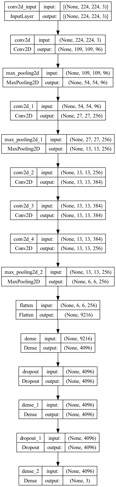

# 复现CV论文网络结构（按发布时间排序）

## 1998年
- LeNet 5 [代码](convnets/let5.py)，[论文](https://ieeexplore.ieee.org/document/726791)  

## 2012年
- AlexNet [代码](convnets/alexnet.py), [论文](https://proceedings.neurips.cc/paper/2012/file/c399862d3b9d6b76c8436e924a68c45b-Paper.pdf)   
> - 使用了 Conv、MaxPool、Flatten、Dense、Dropout 
> - 模型较浅  

## 2013年
- ZFNet [代码](convnets/zfnet.py)，[论文](https://arxiv.org/pdf/1311.2901.pdf)  

## 2014年
- VGG [代码-VGG16](convnets/vgg16.py), [代码-VGG19](convnets/vgg19.py), [论文](https://arxiv.org/pdf/1409.1556.pdf)
  > - 引入 3x3 卷积核
  > - 模型做到更深  

- GoogLeNet [代码](convnets/googlenet.py), [论文](https://arxiv.org/abs/1409.4842)
  > - 提出 Inception module 捕获不同尺度 feature map   
  > - 使用 1x1、3x3、5x5 尺度卷积核、3x3 MaxPool   
  > - 1x1用于降维  
  > - 使用 *Concatenate* 融合各个尺度 feature map  

## 2015年
- ResNet [代码-ResNet18](convnets/Resnet18.py),[代码-ResNet34](convnets/Resnet34.py),[代码-ResNet50](convnets/Resnet50.py),[代码-ResNet101](convnets/Resnet101.py),[代码-ResNet152](convnets/Resnet152.py), [论文](https://arxiv.org/abs/1512.03385)
  > - 引入 Residule module 解决梯度爆炸/消失问题 
  > - 使用 *Add* 融合 feature map
  > - 无 Flatten，用平均池化或全局池化代替

- Inception V3 [论文](https://arxiv.org/abs/1512.00567)
  > 比[GooLeNet](convnets/googlenet.py)更优化，将 3x3 卷积核拆成 1x3 和 3x1 卷积核，目的是为了减少参数量

## 2016年
- DenseNet [代码](convnets/densenet121.py), [论文](https://arxiv.org/abs/1608.06993) 
  > - 比 ResNet 更进一步，A层不仅跟A-1层相关，还跟A-2、A-3、A-4……有关    
  > - 参数量爆炸
  > - 无 Flatten，用平均池化或全局池化代替

  
- Inception-ResNet [论文](https://arxiv.org/abs/1602.07261)
  > 结合 Inception 和 Residul 两边的优势
- SqueezeNet [代码](convnets/squeezenet.py), [论文](https://arxiv.org/abs/1602.07360)
  > - 输入先经过 1x1，再分别经过 1x1（A） 和 3x3（B）  
  > - 使用 *Concatenate* 叠加 A 和 B

## 2017年
- Xception [代码](convnets/xception.py), [论文](https://arxiv.org/abs/1610.02357)
  > - 引入 **Separable Conv**  
  > - 使用 BatchNormalization
  > - 使用 *Add* 融合 feature map

- ResNext [代码](convnets/resnext50.py), [论文](https://arxiv.org/abs/1611.05431v2)
  > - 引入 **Group Conv**
  > - 使用 *Add* 融合 feature map

- MobileNet V1 [代码](convnets/mobilenetv1.py), [论文](https://arxiv.org/abs/1704.04861v1)
  > - 引入 **DepthWise Conv**
  > - 引入低性能设备训练的可行性  
  > - 有3个版本，各版本不太一致

- PolyNet [代码](convnets/polynet.py) [论文](https://arxiv.org/abs/1611.05725)
  > 代码不完整，仅表达论文中的思想

- DPN [论文](https://arxiv.org/abs/1707.01629)
  > - 论文认为 ResNet 是 DenseNet 的一种特例  
  > - 结合两者的优点，并共享了一部分权重，所以叫双路网络

- ShuffleNet [代码](convnets/shufflenet.py) [论文](https://arxiv.org/abs/1707.01083)
  > - 引入 Channel Shuffle
  > - 使用 Group Conv、DepthWise Conv
  > - 使用 *Concatenate* 或 *Add* 融合特征图  
  > - 比 [MobileNet](convnets/mobilenetv1.py) 性能高

- SENet [代码](convnets/senet.py) [论文](https://arxiv.org/abs/1709.01507)
  > 讨论 channels 之间的关系（**Channel Attention**）  
  > Squeeze-and-Excitation 可以作用到现有任何模型中

## 2018年
- MobileNet V2 [代码](convnets/mobilenetv2.py), [论文](https://arxiv.org/abs/1801.04381)  

- ESPNet [论文](https://arxiv.org/pdf/1803.06815.pdf)
  > - 把**Group Conv**、**DepthWise Conv**、**DepthWise dilated sepable Conv**都用上，构造金字塔结构
  > - 既有 *Add，也有*Concatenate*

- ShuffleNetV2 [论文](https://arxiv.org/pdf/1807.11164.pdf)
  > - 提出 Channel Split
  > - 使用 *Concatenate*
  > - 使用 Channel Shuffle

## 2019年
- MobileNet V3 [论文](https://arxiv.org/abs/1905.02244)
  
- HRNet [论文](https://arxiv.org/pdf/1904.04514.pdf)
  > - 通过多分支的策略，将不同感受野的 feature map 融合
  > - 通过分支，最大的保留了特征信息

## 2020年
- RegNet [代码](convnets/regnet.py)，[论文](https://arxiv.org/pdf/2003.13678.pdf)

- EfficientNet [代码-B0](convnets/efficientnet.py), [论文](https://arxiv.org/abs/2104.00298v3)
  > - 提出Comppund Model Scaling 策略（αxβ^2xγ^2≈2）
  > - 通过TPU搜索出来的，实用性不高

## 2022年
- ConvMixer [代码](convnets/convmixer.py), [论文](https://openreview.net/pdf?id=TVHS5Y4dNvM)
> - 使用 Gelu 激活函数
> - [代码](convnets/convmixer.py) 没有体现 Patch Embedding

- ConvNeXt [论文](https://arxiv.org/abs/2201.03545)
  > - 用Transformer的参数配置，干翻DeiT、ViT、Swin Transformer等基于Transformer架构的视觉模型
  > - 玄学。。。

----
> CV圈主要是2个方向：一个是魔改模型结构，另外一个是想尽办法搞到低算力设备上。
